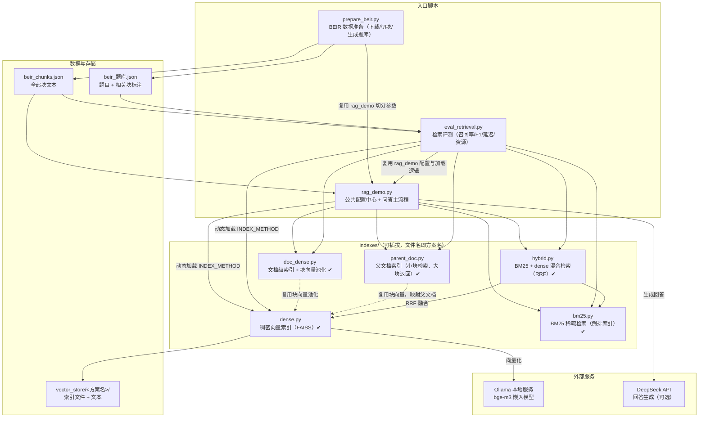

# RAG 索引评测框架（RAG Index Benchmark）

一个可插拔索引方案的检索增强生成（RAG）系统与检索评测框架：以 BEIR 基准为评测数据源，对不同的索引方案（稠密向量、稀疏检索、混合检索、父文档索引……）进行统一的召回率、精确率、延迟与资源占用评测，并支持一键切换索引方案运行问答。

- **本地嵌入**：Ollama + bge-m3（多语言嵌入模型），无需云端嵌入 API
- **本地索引**：FAISS 向量索引，向量数据落盘本地
- **生成模型**：DeepSeek（仅问答模式需要）
- **评测基准**：BEIR（nfcorpus），自动将文档级标注转换为块级题库

## 核心特点

1. **可插拔索引方案**：每个索引方案是 [indexes/](indexes/) 目录下的一个独立脚本，只需实现 `build_index(chunks, config)` 和 `search(question, config)` 两个函数；主程序通过配置区 `INDEX_METHOD` 一键切换，主程序零改动（接口约定见 [indexes/README.md](indexes/README.md)）。
2. **完整的评测闭环**：逐题检索并自动比对标注，输出多档位（Top-1/5/10/20/50）召回率、精确率、F1、题目命中率，以及建库耗时、查询延迟、内存/磁盘占用。
3. **评测与运行同配置**：评测脚本直接复用主程序的配置与索引方案加载逻辑，不存在"评测一套、运行一套"的配置不一致问题。
4. **BEIR 基准数据源**：`prepare_beir.py` 自动下载数据集并生成块级题库，评测与问答共用同一份数据。

## 架构图



**一次问答的数据流：**


## 快速开始

### 环境要求

| 依赖 | 说明 |
|---|---|
| Python 3.11+ | 运行环境 |
| Ollama | 本地嵌入服务，需 `ollama pull bge-m3` |
| DeepSeek API Key | 可选，仅"生成回答"模式需要；纯检索评测不需要 |

### 安装与运行

```bash
# 1. 安装 Python 依赖
pip install openai langchain-text-splitters langchain-core faiss-cpu numpy certifi
# 可选：评测内存占用需要 psutil
pip install psutil

# 2. 启动 Ollama 并拉取嵌入模型（需先安装 Ollama 并启动服务）
ollama pull bge-m3

# 3. 准备 BEIR 数据（自动下载 nfcorpus 数据集，切块并生成块级题库）
python prepare_beir.py

# 4. 构建索引并跑完整评测（输出 评测报告_<方案名>_beir.txt，方案由 INDEX_METHOD 决定）
python eval_retrieval.py

# 5. 运行问答示例（需先设置 DEEPSEEK_API_KEY 环境变量）
python rag_demo.py
```

### 常用参数（在 [rag_demo.py](rag_demo.py) 配置区修改）

| 参数 | 默认值 | 说明 |
|---|---|---|
| `INDEX_METHOD` | `"dense"` | 索引方案名 = `indexes/` 下的文件名（不含 .py） |
| `RETRIEVE_ONLY` | `False` | 置 `True` 只打印检索片段不调大模型，快速对比方案召回 |
| `N_RESULTS` | `3` | 问答模式召回片段数 |
| `CHUNK_SIZE` / `CHUNK_OVERLAP` | `500` / `50` | 文档切分参数 |
| `EMBEDDING_MODEL` | `"bge-m3"` | Ollama 中的嵌入模型名 |

评测参数（召回档位、查询重复次数、数据源模式等）在 [eval_retrieval.py](eval_retrieval.py) 配置区修改。

## 评测结果（方案对比）

**评测环境**：nfcorpus 数据集 ｜ 语料 3633 篇文档切为 17071 块 ｜ 323 道题 ｜ 嵌入模型 bge-m3（本地 CPU）｜ dense/doc_dense 检索方式为 FAISS 暴力检索（IndexFlatIP + L2 归一化，即余弦相似度）

**评测口径**：BEIR 的 qrels 为文档级标注，本框架按官方方式做**文档级命中判断**——检索片段经"文本反查块编号 → 块编号映射来源文档"后与相关文档比对。nfcorpus 平均每题约 38 篇相关文档（块级相关块被截断至最多 50 个），文档级召回率天然低于块级口径。

### 方案对比总表

| 方案 | Recall@5 | Recall@10 | Recall@20 | Recall@50 | 建库耗时 | 平均查询延迟 | 索引文件大小 |
|---|---|---:|---:|---:|---:|---:|---:|---:|
| parent_doc（父文档：小块检索大块返回） | 11.98% | 14.94% | 18.07% | 22.45% | 0.09 秒 | 230.6 毫秒 | 15 MB（复用子索引） |
| hybrid（BM25+dense，RRF 融合） | 11.74% | 14.21% | 17.54% | 22.10% | 3.43 秒 | 230.1 毫秒 | 88 MB（含子索引） |
| doc_dense（文档级索引，块向量池化） | 11.33% | 14.00% | 17.11% | 21.50% | 4.28 秒 | 243.6 毫秒 | 15 MB |
| dense（稠密向量，基线） | 11.11% | 13.63% | 16.78% | 20.70% | 220.27 秒 | 1948.8 毫秒 | 73 MB |
| bm25（稀疏倒排） | 10.58% | 13.35% | 15.72% | 19.13% | 3.24 秒 | 2.6 毫秒 | 15 MB |

> **口径说明**（对比前必读）：
>
> - **建库耗时**：dense 含 17071 块全量向量化（本地 CPU 跑 bge-m3，占总耗时绝大部分）；doc_dense 与 parent_doc 复用已有块向量（分别做池化/直接复用），零向量化成本（从零建库须先有块向量，即 dense 的建库耗时为其前置成本）；bm25 纯 CPU 构建倒排索引，无需向量化；hybrid 的 3.43 秒是复用已有 dense 子索引（跳过向量化）后的耗时，从零建库 = 3.24 + 220.27 秒。
> - **查询延迟**：dense / doc_dense / hybrid / parent_doc 为端到端延迟（含问题向量化，预热后 3 次取平均）；bm25 无需向量化问题，2.6 毫秒即纯检索耗时。dense 旧报告的平均值混入一次 Ollama 服务卡顿离群值（单题最慢 55.0 万毫秒，该题重测最快 166.2 毫秒），剔除后其余 322 题平均约 246.7 毫秒；hybrid 与 parent_doc 本次评测均无离群值（最慢单题分别 381.8 / 317.0 毫秒），与"dense 剔除离群值后约 246.7 毫秒"基本吻合，可作交叉印证。
> - **索引文件大小**：`vector_store/<方案目录>/` 实际磁盘占用（2026-09-26 实测）；hybrid 复用 bm25 与 dense 两个子索引（15 + 73 MB），parent_doc 复用 dense 块向量索引、自身仅落盘 0.04 MB 元信息。
> - 完整档位数据（含精确率、F1、题目命中率）见各方案报告：[评测报告_parent_doc_beir.txt](评测报告_parent_doc_beir.txt)（2026-09-26）、[评测报告_hybrid_beir.txt](评测报告_hybrid_beir.txt)（2026-09-26）、[评测报告_doc_dense_beir.txt](评测报告_doc_dense_beir.txt)（2026-09-02）、[评测报告_dense_beir.txt](评测报告_dense_beir.txt)（2026-08-29）、[评测报告_bm25_beir.txt](评测报告_bm25_beir.txt)（2026-09-06）。

**初步结论**（两个已获数据验证的研究结论）：

1. **RRF 融合有效**：hybrid 在全部四个召回档位上同时超过两个子方案（比 dense 高 0.6~1.4 个百分点，比 bm25 高 0.9~3.0 个百分点），验证了"关键词精确匹配 + 语义泛化匹配"互补的假设——两个来源的靠前名次在 RRF 中互相加强，这正是工业界混合检索的标准做法。
2. **检索粒度越细，召回越高**：parent_doc（块级向量检索）全档位高于 doc_dense（文档级池化向量检索）0.65~0.96 个百分点，验证了"池化平均会稀释语义"的假设——文档级向量把一篇文档的多个主题平均成一个向量，块级向量则保留每个主题的原始语义。两块向量零成本复用同一份数据，是"同一份向量、两种组织方式"的对照实验。

parent_doc 当前为全场最高召回率（Recall@50 = 22.45%），且建库零成本、返回文档级完整上下文（对下游问答最友好）。后续阶段三的 IVF/HNSW 与 PQ 量化将在 dense 的块向量索引上压缩"全量扫描 + 浮点存储"的代价，直接惠及 dense、hybrid、parent_doc 三个依赖块向量的方案。

### 基线明细（dense，完整档位 + 资源）

| Top-K | 平均召回率 | 平均精确率 | F1 | 题目命中率 |
|------:|----------:|----------:|----:|----------:|
| 1  | 5.31% | 35.91% | 7.78% | 35.91% |
| 5  | 11.11% | 27.31% | 12.51% | 54.80% |
| 10 | 13.63% | 22.45% | 13.31% | 62.23% |
| 20 | 16.78% | 17.55% | 13.60% | 70.59% |
| 50 | 20.70% | 11.81% | 12.30% | 77.40% |

| 指标 | 数值 | 说明 |
|---|---|---|
| 建库耗时 | 220.27 秒 | 含 17071 块本地 CPU 向量化 |
| 内存增量 | 78.0 MB | 评测进程建库前后差（不含 Ollama 进程） |
| 磁盘占用 | 约 72.7 MB | `vector_store/faiss_dense/`（index.faiss + texts.json） |
| 平均查询延迟 | 1948.8 毫秒 | 端到端（含问题向量化），预热后 3 次取平均 |

> 说明：dense 的延迟主要来自 bge-m3 在本地 CPU 上的问题向量化；FAISS 暴力检索本身为 O(N·d) 全量扫描，随着语料规模增大，这正是后续引入 IVF/HNSW 近似检索与量化压缩的优化空间（见 Roadmap）。

## 添加新的索引方案

1. 复制 [indexes/dense.py](indexes/dense.py)，改名为你的方案名（如 `parent_doc.py`）；
2. 实现 `build_index(chunks, config)` 与 `search(question, config)` 两个函数（接口约定见 [indexes/README.md](indexes/README.md)）；
3. 在 [rag_demo.py](rag_demo.py) 配置区把 `INDEX_METHOD` 改为你的文件名；
4. 运行 `python eval_retrieval.py` 得到该方案的独立评测报告，与已有方案对比。

## 项目结构

```
RAG/
├── rag_demo.py              # 主程序：公共配置中心 + 问答流程
├── eval_retrieval.py        # 检索评测脚本（多指标 + 报告输出）
├── prepare_beir.py          # BEIR 数据准备（下载/切块/块级题库生成）
├── indexes/                 # 可插拔索引方案目录
│   ├── README.md            # 方案接口约定
│   ├── dense.py             # 稠密向量索引方案（FAISS）
│   ├── doc_dense.py         # 文档级索引（块向量池化，先搜文档再取块）
│   ├── bm25.py              # BM25 稀疏倒排索引（纯标准库）
│   ├── hybrid.py            # BM25 + dense 混合检索（RRF 分数融合）
│   └── parent_doc.py        # 父文档索引（小块检索、大块返回）
├── experiments/             # 块向量池化实验（doc_dense 方案来源）
├── vector_store/            # 向量索引存储根目录（各方案独立子目录）
├── beir_data/               # BEIR 数据集缓存
├── beir_chunks.json         # 块文件（prepare_beir.py 生成）
├── beir_题库.json            # 块级标注题库（prepare_beir.py 生成）
├── 评测报告_dense_beir.txt   # 基线评测报告
├── 评测报告_doc_dense_beir.txt
├── 评测报告_bm25_beir.txt
├── 评测报告_hybrid_beir.txt
└── 评测报告_parent_doc_beir.txt
```

## Roadmap

- [x] 稠密向量索引（FAISS 暴力检索 + 余弦相似度）
- [x] BEIR 基准评测闭环（召回率/精确率/F1/延迟/资源占用）
- [x] BM25 稀疏检索方案（纯标准库倒排索引，零依赖）
- [x] 文档级索引方案（doc_dense：块向量池化 + 先搜文档再取块）
- [x] 混合检索方案（hybrid：BM25 + 稠密向量，RRF 分数融合）
- [x] 父文档索引方案（parent_doc：小块检索、大块返回，零向量化成本）
- [ ] 近似最近邻检索（IVF / HNSW）与召回率-延迟曲线
- [ ] 向量量化压缩（PQ / 标量量化）与内存-磁盘占用对比

## 许可证

[MIT](LICENSE)
