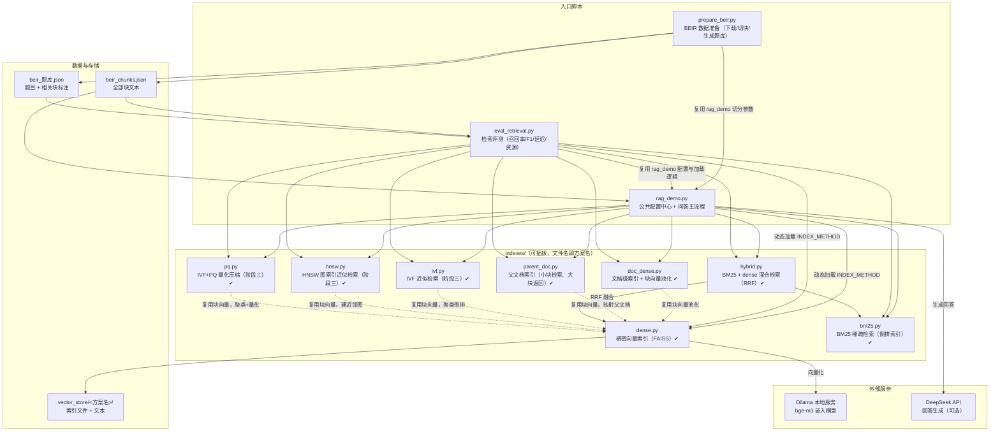

# RAG 索引评测框架（RAG Index Benchmark）

一个可插拔索引方案的检索增强生成（RAG）系统与检索评测框架：以 BEIR 基准为评测数据源，对不同的索引方案（稠密向量、稀疏检索、混合检索、父文档索引……）进行统一的召回率、精确率、延迟与资源占用评测，并支持一键切换索引方案运行问答。

- **本地嵌入**：Ollama + bge-m3（多语言嵌入模型），无需云端嵌入 API
- **本地索引**：FAISS 向量索引，向量数据落盘本地
- **生成模型**：DeepSeek（仅问答模式需要）
- **评测基准**：BEIR（nfcorpus），自动将文档级标注转换为块级题库

## 核心特点

1. **可插拔索引方案**：每个索引方案是 [indexes/](indexes/) 目录下的一个独立脚本，只需实现 `build_index(chunks, config)` 和 `search(question, config)` 两个函数；主程序通过配置区 `INDEX_METHOD` 一键切换，主程序零改动（接口约定见 [indexes/README.md](indexes/README.md)）。
2. **完整的评测闭环**：逐题检索并自动比对标注，输出多档位（Top-1/5/10/20/50）召回率、精确率、F1、题目命中率，以及建库耗时、查询延迟、内存/磁盘占用。
3. **评测与运行同配置**：评测脚本直接复用主程序的配置与索引方案加载逻辑，不存在"评测一套、运行一套"的配置不一致问题。
4. **BEIR 基准数据源**：`prepare_beir.py` 自动下载数据集并生成块级题库，评测与问答共用同一份数据。

## 架构图



**一次问答的数据流：**


## 快速开始

### 环境要求

| 依赖 | 说明 |
|---|---|
| Python 3.11+ | 运行环境 |
| Ollama | 本地嵌入服务，需 `ollama pull bge-m3` |
| DeepSeek API Key | 可选，仅"生成回答"模式需要；纯检索评测不需要 |

### 安装与运行

```bash
# 1. 安装 Python 依赖
pip install openai langchain-text-splitters langchain-core faiss-cpu numpy certifi
# 可选：评测内存占用需要 psutil
pip install psutil

# 2. 启动 Ollama 并拉取嵌入模型（需先安装 Ollama 并启动服务）
ollama pull bge-m3

# 3. 准备 BEIR 数据（自动下载 nfcorpus 数据集，切块并生成块级题库）
python prepare_beir.py

# 4. 构建索引并跑完整评测（输出 评测报告_<方案名>_beir.txt，方案由 INDEX_METHOD 决定）
python eval_retrieval.py

# 5. 运行问答示例（需先设置 DEEPSEEK_API_KEY 环境变量）
python rag_demo.py
```

### 常用参数（在 [rag_demo.py](rag_demo.py) 配置区修改）

| 参数 | 默认值 | 说明 |
|---|---|---|
| `INDEX_METHOD` | `"dense"` | 索引方案名 = `indexes/` 下的文件名（不含 .py） |
| `RETRIEVE_ONLY` | `False` | 置 `True` 只打印检索片段不调大模型，快速对比方案召回 |
| `N_RESULTS` | `3` | 问答模式召回片段数 |
| `CHUNK_SIZE` / `CHUNK_OVERLAP` | `500` / `50` | 文档切分参数 |
| `EMBEDDING_MODEL` | `"bge-m3"` | Ollama 中的嵌入模型名 |

评测参数（召回档位、查询重复次数、数据源模式等）在 [eval_retrieval.py](eval_retrieval.py) 配置区修改。

## 评测结果（方案对比）

**评测环境**：nfcorpus 数据集 ｜ 语料 3633 篇文档切为 17071 块 ｜ 119 道题（仅有强相关标注的题） ｜ 嵌入模型 bge-m3（本地 CPU）｜ dense/doc_dense 检索方式为 FAISS 暴力检索（IndexFlatIP + L2 归一化，即余弦相似度）

**评测口径**：BEIR 的 qrels 为文档级标注，本框架按官方方式做**文档级命中判断**——检索片段经"文本反查块编号 → 块编号映射来源文档"后与相关文档比对；相关判定采用 **BEIR 官方口径：仅强相关（score=2）算相关**（nfcorpus 弱相关标注占 95.3%，若把弱相关也算相关，每题平均相关文档多达 38 篇、最多 475 篇，召回率会被严重稀释，详见 [prepare_beir.py](prepare_beir.py) 注释）。按此口径 nfcorpus 仅 119 道题有强相关标注，每题平均约 4.8 篇强相关文档。

### 方案对比总表

| 方案 | Recall@5 | Recall@10 | Recall@20 | Recall@50 | 建库耗时 | 平均查询延迟 | 索引文件大小 |
|---|---|---:|---:|---:|---:|---:|---:|---:|
| parent_doc（父文档：小块检索大块返回） | 29.35% | 36.06% | 44.61% | 53.79% | 0.09 秒 | 230.6 毫秒 | 15 MB（复用子索引） |
| hybrid（BM25+dense，RRF 融合） | 26.55% | 31.85% | 41.32% | 53.57% | 3.43 秒 | 230.1 毫秒 | 88 MB（含子索引） |
| doc_dense（文档级索引，块向量池化） | 32.12% | 38.54% | 44.56% | 52.24% | 4.28 秒 | 243.6 毫秒 | 15 MB |
| dense（稠密向量，基线） | 27.30% | 32.11% | 41.23% | 50.28% | 220.27 秒 | 1948.8 毫秒 | 73 MB |
| ivf（IVF 近似检索，nprobe=32） | 26.48% | 31.82% | 39.00% | 48.68% | 0.65 秒 | 196.2 毫秒 | 74 MB |
| hnsw（HNSW 图索引近似检索，ef_search=64） | 26.32% | 32.17% | 40.55% | 50.14% | 2.37 秒 | 208.0 毫秒 | 77 MB |
| pq（IVF+PQ 量化压缩，M=32/nprobe=32） | 19.38% | 22.72% | 30.32% | 40.31% | 8.46 秒 | 34.7 毫秒※ | 9 MB |
| bm25（稀疏倒排） | 21.87% | 27.94% | 34.28% | 44.80% | 3.24 秒 | 2.6 毫秒 | 15 MB |

> **口径说明**（对比前必读）：
>
> - **建库耗时**：dense 含 17071 块全量向量化（本地 CPU 跑 bge-m3，占总耗时绝大部分）；doc_dense 与 parent_doc 复用已有块向量（分别做池化/直接复用），零向量化成本（从零建库须先有块向量，即 dense 的建库耗时为其前置成本）；bm25 纯 CPU 构建倒排索引，无需向量化；hybrid 的 3.43 秒是复用已有 dense 子索引（跳过向量化）后的耗时，从零建库 = 3.24 + 220.27 秒；ivf 与 hnsw 同样复用 dense 的块向量（分别做 k-means 训练/建图），零向量化成本。
> - **查询延迟**：dense / doc_dense / hybrid / parent_doc 为端到端延迟（含问题向量化，预热后 3 次取平均）；bm25 无需向量化问题，2.6 毫秒即纯检索耗时。dense 旧报告的平均值混入一次 Ollama 服务卡顿离群值（单题最慢 55.0 万毫秒，该题重测最快 166.2 毫秒），剔除后其余 322 题平均约 246.7 毫秒；hybrid 与 parent_doc 本次评测均无离群值（最慢单题分别 381.8 / 317.0 毫秒），与"dense 剔除离群值后约 246.7 毫秒"基本吻合，可作交叉印证。pq 行的 34.7 毫秒为 2026-10-07 实测，与其余方案的约 200 毫秒差异来自测量环境变化（疑似 Ollama 服务状态），并非 pq 方案加速了向量化——方案间的延迟比较以纯检索微基准（bench_retrieval.py / pq_curve.py）为准。
> - **索引文件大小**：`vector_store/<方案目录>/` 实际磁盘占用（2026-09-26 实测）；hybrid 复用 bm25 与 dense 两个子索引（15 + 73 MB），parent_doc 复用 dense 块向量索引、自身仅落盘 0.04 MB 元信息。
> - 完整档位数据（含精确率、F1、题目命中率）见各方案报告：[评测报告_parent_doc_beir.txt](评测报告_parent_doc_beir.txt)（2026-10-03）、[评测报告_hybrid_beir.txt](评测报告_hybrid_beir.txt)（2026-10-03）、[评测报告_doc_dense_beir.txt](评测报告_doc_dense_beir.txt)（2026-10-03）、[评测报告_dense_beir.txt](评测报告_dense_beir.txt)（2026-10-03）、[评测报告_bm25_beir.txt](评测报告_bm25_beir.txt)（2026-10-03）、[评测报告_ivf_beir.txt](评测报告_ivf_beir.txt)（2026-10-03）、[评测报告_hnsw_beir.txt](评测报告_hnsw_beir.txt)（2026-10-04）、[评测报告_pq_beir.txt](评测报告_pq_beir.txt)（2026-10-07）。

**研究结论**（官方口径下已获数据验证）：

1. **RRF 融合在深档位有效、浅档位稀释**：hybrid 全档位超过 bm25（高 4.7~8.8 个百分点）；但与 dense 相比呈"深档位反超"——Recall@5 低 0.75、@10 低 0.26、@20 高 0.09、@50 高 3.29 个百分点。即关键词信号在浅档位引入噪声（bm25 的高分词法匹配挤占名额），在深档位才发挥互补长尾价值，验证了 RRF 融合"深召回"的定位。
2. **检索粒度与档位存在交互：浅档位文档级更准、深档位块级更全**：doc_dense（文档级池化）在 Recall@5/10 比 parent_doc（块级）高 2.77/2.48 个百分点，Recall@20 持平（差 0.05），Recall@50 被反超 1.55 个百分点。原因：文档级每个返回名额必来自不同文档（浅档位覆盖文档数最大化），而块级在块间有 50 字符重叠、Top-K 块易扎堆于少数文档；但块级能精确定位相关文档中"真正相关的块"，长尾召回更强。

**综合结论**：官方口径下各方案召回率整体翻倍以上（对照旧口径含弱相关的数字见 git 历史 commit `0055336` 及 2026-09-26 报告），parent_doc 为深档位召回冠军（Recall@50 = 53.79%）、doc_dense 为浅档位精准冠军（Recall@5 = 32.12%）。parent_doc 建库零成本、返回文档级完整上下文，对下游问答最友好。阶段三的 IVF/HNSW 已在 dense 的块向量索引上压缩"全量扫描"的代价（22~37 倍查询加速换不到 2 个百分点召回损失），PQ 量化已压缩"浮点存储"的代价（64~256 倍，见下节），三者直接惠及 dense、hybrid、parent_doc 三个依赖块向量的方案。

### 阶段三：IVF 与 HNSW 近似检索（召回率-延迟曲线）

以 dense 为基线的 **全档位扫描**（[experiments/ann_curve.py](experiments/ann_curve.py)）：IVF 的旋钮是 nprobe（搜索的簇数），HNSW 的旋钮是 ef_search（图导航搜索宽度），两者档位越大越接近暴力检索：

| 档位 | Recall@10 | Recall@50 | 纯检索延迟 | 加速比 |
|---|---:|---:|---:|---:|
| dense（暴力，参照） | 31.83% | 50.28% | 8.07 ms | 1.00x |
| ivf nprobe=1 | 19.21% | 26.76% | 0.063 ms | 127x |
| **ivf nprobe=32（甜蜜点）** | 31.54% | 48.68% | 0.45 ms | 18x |
| ivf nprobe=256（=nlist） | 31.83% | 50.28% | 3.53 ms | 2.3x |
| hnsw ef=4 | 25.34% | 38.39% | 0.060 ms | 135x |
| hnsw ef=16 | 30.93% | 46.12% | 0.136 ms | 59x |
| **hnsw ef=32（甜蜜点）** | 32.69% | 50.44% | 0.217 ms | 37x |
| hnsw ef=64 | 31.89% | 50.14% | 0.364 ms | 22x |
| hnsw ef=256 | 31.83% | 50.28% | 1.071 ms | 7.5x |

**研究结论（阶段三，两条 ANN 路线对比）**：

1. **两条路线的高档位均收敛到暴力检索、逐位一致**（ivf nprobe=256 与 hnsw ef=256 的四个召回档位与 dense 完全相同），交叉验证了两种近似算法的误差都只来自"减少搜索范围"，算法本身没有其他信息损失。
2. **低延迟档位 HNSW 全面优于 IVF**：同为 0.06 ms 量级，hnsw ef=4 的 Recall@50（38.39%）比 ivf nprobe=1（26.76%）**高 11.6 个百分点**；同为 0.14 ms 量级，ef=16 比 nprobe=8 高 4.2 个百分点。原因：IVF 的 nprobe 是"整簇粒度的粗闸门"（每个簇平均含 67 块，nprobe=1 只覆盖 67 块），而 HNSW 图的导航天然按"到查询的距离"分配搜索预算，同样预算下能摸到更远的真近邻。
3. **甜蜜点区间**：HNSW 的 ef_search=32~64 以 **22~37 倍查询加速换取不到 2 个百分点的召回损失**（Recall@50 = 50.44/50.14% vs 暴力 50.28%），性价比优于 IVF 的 18 倍；IVF 的优势则在工程侧——索引更小（74 vs 77 MB）、实现更简单、增量插入友好。
4. 完整数据与曲线图见 `experiments/results/ann_curve.csv` 与 `ann_curve.png`（运行 [experiments/ann_curve.py](experiments/ann_curve.py) 可再生；延迟为纯检索微基准 [experiments/bench_retrieval.py](experiments/bench_retrieval.py) 同口径，不含问题向量化）。

### 阶段三：PQ 乘积量化压缩（压缩比-召回-延迟）

固定 nprobe=32，扫描 PQ 子段数 M（[experiments/pq_curve.py](experiments/pq_curve.py)）：

| 档位 | 压缩比 | 索引文件 | Recall@10 | Recall@50 | 纯检索延迟 |
|---|---:|---:|---:|---:|---:|
| dense（暴力参照） | 1x | 66.68 MB | 31.83% | 50.28% | 7.59 ms |
| ivf nprobe=32（无量化） | 1x | 67.82 MB | 31.54% | 48.68% | 0.48 ms |
| ivfpq M=16 | 256x | 2.39 MB | 21.13% | 37.43% | 0.13 ms |
| ivfpq M=32 | 128x | 2.65 MB | 22.72% | 40.22% | 0.16 ms |
| ivfpq M=64 | 64x | 3.17 MB | 27.22% | 44.79% | 0.25 ms |

**研究结论（阶段三第三条，存储压缩线）**：

1. **PQ 同时压缩"存储"与"距离计算"**：向量部分从 66.7 MB（float32，4096 字节/块）压缩到 0.26~1.03 MB（64~256 倍），索引文件降到 2.4~3.2 MB；检索时距离计算从 1024 维浮点内积变成 M 次查表加法，延迟反而比同档位 ivf 更低（M=32 时 0.16 vs 0.48 ms）。
2. **压缩比-召回权衡在困难数据集上代价更大**：nfcorpus 是 BEIR 中 dense 检索垫底难度，量化误差被放大——M=64 损失 3.9 个百分点（Recall@50 44.79%）、M=32 损失 8.5、M=16 损失 12.9；在易检索数据集上该损失通常只有 1~3 个百分点。
3. **M=64 是当前语料规模的甜点**：64 倍压缩、召回损失 <4 个百分点、纯检索 0.25 ms（约 30 倍加速于暴力检索）；若磁盘资源极端受限（如移动端/嵌入式场景）可选 M=16 换 256 倍压缩。
4. **与 IVF/HNSW 的关系是正交可叠加**：IVF/HNSW 压缩"全量扫描"的时间代价，PQ 压缩"浮点存储"的空间代价，且 PQ 直接叠加在 IVF 框架上（本方案即 IVFPQ），阶段三三条线共同构成"检索加速 + 存储压缩"的完整存储层优化故事。完整数据见 `experiments/results/pq_curve.csv`（运行脚本可再生）。

### 基线明细（dense，完整档位 + 资源）

| Top-K | 平均召回率 | 平均精确率 | F1 | 题目命中率 |
|------:|----------:|----------:|----:|----------:|
| 1  | 14.78% | 36.97% | 18.71% | 36.97% |
| 5  | 27.30% | 26.39% | 22.70% | 55.46% |
| 10 | 32.11% | 21.09% | 21.76% | 61.34% |
| 20 | 41.23% | 16.43% | 20.10% | 71.43% |
| 50 | 50.28% | 10.45% | 15.41% | 79.83% |

| 指标 | 数值 | 说明 |
|---|---|---|
| 建库耗时 | 220.27 秒 | 含 17071 块本地 CPU 向量化 |
| 内存增量 | 78.0 MB | 评测进程建库前后差（不含 Ollama 进程） |
| 磁盘占用 | 约 72.7 MB | `vector_store/faiss_dense/`（index.faiss + texts.json） |
| 平均查询延迟 | 1948.8 毫秒 | 端到端（含问题向量化），预热后 3 次取平均 |

> 说明：dense 的延迟主要来自 bge-m3 在本地 CPU 上的问题向量化；FAISS 暴力检索本身为 O(N·d) 全量扫描，随着语料规模增大，这正是后续引入 IVF/HNSW 近似检索与量化压缩的优化空间（见 Roadmap）。

## 添加新的索引方案

1. 复制 [indexes/dense.py](indexes/dense.py)，改名为你的方案名（如 `parent_doc.py`）；
2. 实现 `build_index(chunks, config)` 与 `search(question, config)` 两个函数（接口约定见 [indexes/README.md](indexes/README.md)）；
3. 在 [rag_demo.py](rag_demo.py) 配置区把 `INDEX_METHOD` 改为你的文件名；
4. 运行 `python eval_retrieval.py` 得到该方案的独立评测报告，与已有方案对比。

## 项目结构

```
RAG/
├── rag_demo.py              # 主程序：公共配置中心 + 问答流程
├── eval_retrieval.py        # 检索评测脚本（多指标 + 报告输出）
├── prepare_beir.py          # BEIR 数据准备（下载/切块/块级题库生成）
├── indexes/                 # 可插拔索引方案目录
│   ├── README.md            # 方案接口约定
│   ├── dense.py             # 稠密向量索引方案（FAISS）
│   ├── doc_dense.py         # 文档级索引（块向量池化，先搜文档再取块）
│   ├── bm25.py              # BM25 稀疏倒排索引（纯标准库）
│   ├── hybrid.py            # BM25 + dense 混合检索（RRF 分数融合）
│   ├── parent_doc.py        # 父文档索引（小块检索、大块返回）
│   ├── ivf.py               # IVF 近似检索（阶段三，k-means 聚类倒排）
│   ├── hnsw.py              # HNSW 图索引近似检索（阶段三）
│   └── pq.py                # IVF+PQ 乘积量化压缩（阶段三）
├── experiments/             # 实验工具（池化实验、纯检索微基准、召回-延迟曲线、PQ 压缩扫描）
├── vector_store/            # 向量索引存储根目录（各方案独立子目录）
├── beir_data/               # BEIR 数据集缓存
├── beir_chunks.json         # 块文件（prepare_beir.py 生成）
├── beir_题库.json            # 块级标注题库（prepare_beir.py 生成）
├── 评测报告_dense_beir.txt   # 基线评测报告
├── 评测报告_doc_dense_beir.txt
├── 评测报告_bm25_beir.txt
├── 评测报告_hybrid_beir.txt
├── 评测报告_parent_doc_beir.txt
├── 评测报告_ivf_beir.txt
├── 评测报告_hnsw_beir.txt
└── 评测报告_pq_beir.txt
```

## Roadmap

- [x] 稠密向量索引（FAISS 暴力检索 + 余弦相似度）
- [x] BEIR 基准评测闭环（召回率/精确率/F1/延迟/资源占用）
- [x] BM25 稀疏检索方案（纯标准库倒排索引，零依赖）
- [x] 文档级索引方案（doc_dense：块向量池化 + 先搜文档再取块）
- [x] 混合检索方案（hybrid：BM25 + 稠密向量，RRF 分数融合）
- [x] 父文档索引方案（parent_doc：小块检索、大块返回，零向量化成本）
- [x] 近似最近邻检索 IVF 部分（ivf：k-means 聚类倒排，nprobe 召回-延迟曲线已出）
- [x] 近似最近邻检索 HNSW 部分（hnsw：图索引，ef_search 召回-延迟曲线已出，与 IVF 合并对比）
- [x] 向量量化压缩 PQ 部分（pq：IVF+PQ 乘积量化，64~256 倍压缩，压缩比-召回-延迟扫描已出）
- [ ] 规模扫描（向量复制放大到 10 万~100 万块，寻找暴力检索的交叉点）

## 许可证

[MIT](LICENSE)
